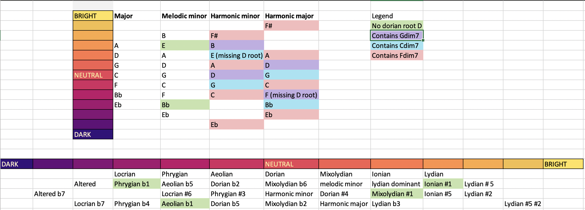

# Computational Harmony v2

Ranking modes of the major, melodic minor, harmonic minor, and harmonic major scales by brightness and darkness.

Applications involve charaterizing and ranking the brightness of all triad combos, all 7th chords added to a root note, and all dominant 7th chord extensions.

Scale network figures generated with networkx.

## History

This repo started when I tried [answering my own question](https://music.stackexchange.com/questions/67293/ranking-dominant-chord-alterations-by-dissonance) about ranking dominant 7th extensions by dissonance.  I realized the notion of dissonance is hard to define and complicted, but I also started to appreciate brightness and darkness as a second axis that may be used for thinking about harmonies and scales.

## Defining brightness and darkness.

You may be familiar with the concept in music theory that locrian mode is darkest, lydian is brightest, and dorian is neutral.  I was able to generalize the notion of brightness to melodic minor, harmonic minor, and harmonic major with the following simple equation:

```brightness = sum (pitch classes (mode_x)) - sum (pitch classes (Dorian))```

## Results

### scale modes arranged along the brightness/darkness spectrum.



### directed graph of scales 

Arrows between scales represent sharing 6 common tones and pointing from bright to dark. 


