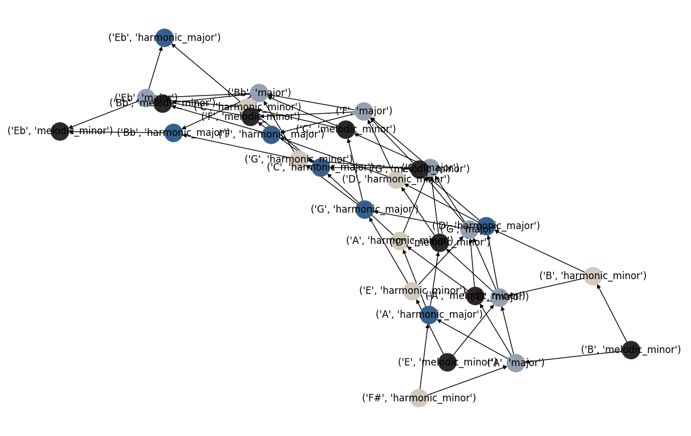

# Brightness Scores for 28 Jazz Modes and 18 Rules for Modulation

This computational music theory project assigns a brightness score for all 28 modes derived from four jazz scales:  major, melodic minor, harmonic minor, and harmonic major.

I constructed scale networks to visualize the interrelations between the 28 modes.  From these networks I found 18 "rules" for modulation that allow for maximally smooth voice leading.

Other applications and experiments found in this code repository include characterizing and ranking the brightness of 1) all triad combos, 2) all 7th chords added to a root note, and 3) all 59 possible dominant 7th chord extensions (for these three applications, I am only considering chords that are subsets of at least one of the 28 modes derived from the four parent scale types.)

All results were obtained using python code in this repository.
Scale network figures were generated with networkx and calculations were done with numpy and pandas.

**TLDR**:   I defined a formula for calculating the brightness score for any 7 note mode, where locrian has a brightness score of -3, dorian 0, and lydian +3.   Dorian, mixolydian b6, harmonic minor mode, and mixolydian b2 are neutral harmonic centers of the brightness/darkness spectrum for major, melodic minor, harmonic minor, and harmonic major, respectively.  By starting at the neutral centers and progressively enumerating jazz modes, "rootless" modes are encountered before all 7 traditional modes are enumerated for all scales except major.  Network analysis finds 18 "rules" for modulation, allowing composers to transition from one scale or mode to another while sharpening or flattening a single note by one half step ("maximally smooth voice leading").  Major scales are the most harmonically versatile of the four scale types, with more options for maximally smooth voice leading.

## History

This repo started when I tried [answering my own question](https://music.stackexchange.com/questions/67293/ranking-dominant-chord-alterations-by-dissonance) about ranking dominant 7th extensions by dissonance.  I learned the notion of dissonance is hard to define and complicated, but I also started to appreciate brightness and darkness as a second axis or property that may be used for thinking about harmonies and scales.

This project is a completely refactored version of my earlier project titled ["Network Theory of Jazz Scales"](https://github.com/TylerMclaughlin/computational-harmony).  Aside from many implementation details, the biggest change is the representation of scale networks as directed graphs, where the directed edges convey whether a given scale transition is bright-to-dark or dark-to-bright (arrows now point from bright-to-dark).  The symmetry between darkness and brightness in music theory underlies the increasingly shared concept of "negative harmony", discovered by Ernst Levy in 1985 and popularized by Jacob Collier.

## Defining brightness and darkness.

You may be familiar with the concept in music theory about major scale modes that the locrian mode is darkest, lydian is brightest, and dorian is neutral. This is related to the circle of fifths, where going up a fourth is considered a transition from bright to dark because a note is flattened (made darker relative to the previous scale). I was able to generalize the notion of brightness beyond major modes to the modes of melodic minor, harmonic minor, and harmonic major with the following simple equation:

```brightness = sum (pitch classes (mode_x)) - sum (pitch classes (Dorian))```

Under this formula, locrian has a brightness score of -3, dorian (neutral) has a brightness score of 0, and lydian has a brightness score of +3.

### Examples

**dorian** is **neutral** by definition because (0 + 2 + 3 + 5 + 7 + 9 + 10) - (0 + 2 + 3 + 5 + 7 + 9 + 10) = 36 - 36 = 0.

**mixolydian b6** is **neutral** because (0 + 2 + 4 + 5 + 7 + 8 + 10) - (0 + 2 + 3 + 5 + 7 + 9 + 10) = 36 - 36 = 0.

**locrian** is **dark** because (0 + 1 + 3 + 5 + 6 + 8 + 10) - (0 + 2 + 3 + 5 + 7 + 9 + 10) = 33 - 36 = -3, a negative brightness score.

**lydian** is **bright** because (0 + 2 + 4 + 6 + 7 + 9 + 11) - (0 + 2 + 3 + 5 + 7 + 9 + 10) = 39 - 36 = +3, a positive brightness score.

### Why choose dorian as the neutral center?

Redditor u/IronAndAero asked about why dorian is the center and if this is a circular argument.  
The assumption that dorian is neutral is based around how the 7 major scale modes have dorian as the center when sorted by brightness, i.e.,  `DARKEST` `locrian` `phrygian` `aeolian` `**dorian**` `mixolydian` `ionian` `lydian` `BRIGHTEST`. Dorian also has bright and dark properties, with the #6 and b3.   Below, you'll see that the other 3 scale types are also balanced around a center, and this center happens to be the exact same center (same score) as for the major scale.  If you were to argue that ionian was the real center, for example, then you'd have to conclude that on average, these 28 jazz modes are skewed towards sounding dark.  While I doubt harmony is skewed like this, it may be the case.  But even if the scales are naturally skewed bright or dark, you can still treat brightness/darkness as "relative to all the other modes".  Under this "relative" formulation, dorian will still remain at the center of the spectrum.

## Results

### Scale modes arranged along the brightness/darkness spectrum

I am considering scales close to C major and all of its modes.  By "close" I mean sharing 6 out of 7 common tones.  Because dorian is the most 'neutral' mode of the major scale (neutral in terms of brightness and darkness), I also tabulated whether the root D of the dorian mode is in these scales.  The following diagram assigns a brightness or darkness score to each of the modes, with positive values indicating brighter modes and negative, darker.


These results are similar to a circle of fifths which has been generalized to three other jazz scale types.
You can see that for all parent scale types except major, the complete generalized circle of fifths requires passing through modes that lack the dorian root D. These rootless modes are transposed duplicates of other modes. Altered scales have their rootless mode at the extremes of bright and dark (locrian and lydian), whereras for harmonic scales, the rootless modes occur at less extreme ends of the spectrum.  

Another interesting observation is that there is a staggered pattern of the three unique diminished seventh chords (considered equivalent under inversion) in the harmonic major and harmonic minor scales.

Perhaps the most useful finding (for negative harmony and jazz composition) is that the neutral modes of the four scale types are dorian (the second mode of the major scale), mixolydian b6 (the fifth mode of the melodic minor scale), harmonic minor (the first mode of the eponymous parent scale), and mixolydian b2 (the fifth mode of the harmonic major scale).  
These modes can thus be used as a reference point for composing with brightness and darkness.  

The idea that dorian, mixolydian b6, harmonic minor, and mixolydian b2 appear to be neutral harmonic centers of these scales is to my knowledge, not proposed in the music theory literature.
Perhaps one could argue for systematic renaming of scales according to their graph-theoretical properties and apparent harmonic symmetry; however, the etymological origins of the names of scales most likely predate computers and graph theory, and musicians benefit from having conventions for communicating ideas. Further, musicians are used to having many names for the same chord (for example "min7b5" and "half-diminished" refer to the same thing). Perhaps a new set of names should be proposed.

### Directed graphs of scales 

Arrows between scales represent sharing 6 common tones and pointing from bright to dark. 

#### Major, harmonic major, and harmonic minor scales near C major

By plotting all 3 scale types (everything but the melodic minor modes) you can see the structure of the scale network in a fairly elegant layout.


If you add the melodic minor modes (below) you can see the network becomes more complex in the sense that there are many overlapping edges.  These graphs cannot be drawn without overlapping edges (graph theoreticians would say they are nonplanar graphs).

#### Network of 30 scales near C major

Network comprised of 7 harmonic minor, 7 harmonic major, and 9 melodic minor scales.



#### Full cycle of 32 scales near C major and all 28 modes 

After adding F# harmonic minor and Eb harmonic major, two scales maximally distant from D dorian that contain the root D, a complete, large-scale cycle emerges.  Adding these two scales now includes the altered b7 mode and lydian #5 #2 mode, meaning all 28 modes are now represented.


### 18 scale transition rules for maximally smooth voice leading

By inspecting the scale networks and considering the relationships between the roots of the scales, the networks are composed of 9 types of bright-to-dark transitions, or equivalently, 9 types of edges (rules 1-9).  The 9 *dark-to-bright* transitions (rules 10-18) can be easily derived by inverting the bright-to-dark transitions (by imagining the arrows point in the opposite direction).

Smooth voice leading is defined as transitioning between chords or scales by changing only a few notes by a small amount.  The 18 "maximally" smooth voice leading rules I have tabulated describe transitions where a single note is sharpened or flattened to transition to a new scale.  Smooth and maximally smooth voice leading is described in more detail in prior work by Dmitri Tymoczko in 2004 and Joseph Strauss in 2005 (see [References](#References)).

rule | starting scale | bright or dark | # semitones | destination scale
---- | -------------- | -------------- | ----------- | ------------
1    | major          | dark           |  5          | major
2    | major          | dark           |  0          | harmonic major
3    | major          | dark           |  0          | melodic minor 
4    | melodic minor  | dark           | -2          | major
5    | melodic minor  | dark           |  0          | harmonic minor
6    | harmonic major | dark           |  5          | melodic minor
7    | harmonic major | dark           |  0          | harmonic minor
8    | harmonic minor | dark           |  3          | major 
9    | harmonic minor | dark           |  3          | harmonic major
10   | major          | bright         | -5          | major
11   | major          | bright         |  2          | melodic minor
12   | major          | bright         | -3          | harmonic minor
13   | melodic minor  | bright         |  0          | major
14   | melodic minor  | bright         | -5          | harmonic major
15   | harmonic major | bright         |  0          | major
16   | harmonic major | bright         | -3          | harmonic minor
17   | harmonic minor | bright         |  0          | melodic minor
18   | harmonic minor | bright         |  0          | harmonic major

According to these rules, for every major scale, you can transition to 3 scales by flattening one note a single half step (3 maximally smooth bright-to-dark transitions).  
For the three other scale types--melodic minor, harmonic minor, and harmonic major, you can transition to only two other scales by flattening a single note.
Surprisingly yet satisfyingly, for *dark-to-bright* transitions with *sharpening* a single note (rules 10-18), the number of transitions from each starting scale type is identical to that for the *bright-to-dark* transitions, although the destination scale types are different. In other words, the transitions have nuanced yet symmetric properties.  
Overall, the finding that there are more rules starting from major scale than the 3 other scale types suggests melodic minor, harmonic minor, and harmonic major scales are less versatile in terms of voice leading opportunities.  This may be part of why they are perceived as more dissonant than the major scales (this dissonance is from my own personal experience, citation needed).  The maximal evenness property of major scales (or rather that the notes of the major scale are more evenly distributed throughout pitch space than the three other seven note scales) seems to be what allows for more voice leading options, I have not rigorously investigated this although Richard Cohn talks about this in his book 'Audacious Euphony" (thanks Ian Campbell).

These maximally smooth scale transitions could be used as rules for creating generative jazz compostions with a hidden markov model, for example, using the dictionary I have constructed in [this python file](code/scale_change_rules.py).  Or they may assist with choosing modulations in traditional jazz composition.


## References

Levy, Ernst. A theory of harmony. Suny Press, 1985.

Tymoczko, Dmitri. "Scale networks and Debussy." Journal of Music Theory 48.2 (2004): 219-294.

Straus, Joseph N. "Voice leading in set-class space." Journal of Music Theory 49.1 (2005): 45-108.
